# ROS 2 tracing

Design document for ROS 2 tracing, instrumentation, and analysis effort.

**Table of contents**
1. [Introduction](#introduction)
2. [Goals and requirements](#goals-and-requirements)
    1. [Goals](#goals)
    2. [Requirements: instrumentation](#requirements-instrumentation)
    3. [Requirements: analysis & visualization](#requirements-analysis-visualization)
    4. [Tools/accessibility](#toolsaccessibility)
3. [Instrumentation design](#instrumentation-design)
    1. [Flow description](#flow-description)
        1. [Process creation](#process-creation)
        2. [Node/component creation](#nodecomponent-creation)
        3. [Publisher creation](#publisher-creation)
        4. [Subscription creation](#subscription-creation)
        5. [Executors](#executors)
        6. [Subscription callbacks](#subscription-callbacks)
        7. [Message publishing](#message-publishing)
        8. [Service creation](#service-creation)
        9. [Service callbacks](#service-callbacks)
        10. [Client creation](#client-creation)
        11. [Client request](#client-request)
        12. [Timer creation](#timer-creation)
        13. [Timer callbacks](#timer-callbacks)
4. [Design & implementation notes](#design-implementation-notes)
    1. [Targeted tools/dependencies](#targeted-toolsdependencies)
    2. [Design](#design)
5. [Architecture](#architecture)
    1. [Timeline](#timeline)
    2. [Notes on client libraries](#notes-on-client-libraries)
    3. [ROS 1/2 compatibility](#ros-12-compatibility)
6. [Tools packages](#tools-packages)
7. [Analysis](#analysis)
    1. [Analysis design](#analysis-design)
    1. [Analysis architecture](#analysis-architecture)

## Introduction

Tracing allows to record run-time data from a system, both for system data (e.g., when a process
is being scheduled, or when I/O occurs) and for user-defined data. This package helps with
user-defined trace data within the ROS 2 framework, e.g. to trace when messages arrive,
when timers fire, when callbacks are being run, etc.

## Goals and requirements

### Goals

1. Provide low-overhead tools and resources for robotics software development based on ROS 2.
2. Make tracing easier to use with ROS.

### Requirements: instrumentation

Instrumentation should be built around the main uses of ROS 2, and should include relevant information:

1. Overall
    1. When creating a publisher/subscriber/service/client/etc., appropriate references should be kept in order to correlate with other tracepoints related to the same instance.
1. Publishers & subscriptions
    1. When creating a publisher/subscription, the effective topic name should be included (i.e. including namespace and after remapping).
    2. When publishing a message, some sort of message identifier should be included in the tracepoint so it can be tracked through DDS up to the subscriber's side.
3. Callbacks (subscription, service, client, timer)
    1. Callback function symbol should be included, whenever possible.
    2. Information about callback execution (e.g. start & end) should be available.
4. Timers
    1. Information about the period should be available.
5. Executors
    1. Information about spin cycles & periods should be available.
6. Others
    1. Provide generic tracepoints for user code.

### Requirements: analysis & visualization

Analyses process trace data. They should be general enough to be useful for different use-cases, e.g.:

* Callback duration
* Time between callbacks (between two callback starts and/or a callback end and a start)
* Message age (as the difference between processing time and message timestamp)
* Message size
* Memory usage
* Execution time/proportion accross a process' nodes/components
* Interruptions (noting that these may be more useful as time-based metrics instead of overall statistics):
    * scheduling events during a callback
    * delay between the moment a thread becomes ready and when it's actually scheduled
    * CPU cycles

with mean, stdev, etc. when applicable.

Generic tracepoints for ROS 2 user code could be applied to a user-provided model for higher-level behaviour statistics and visualization.

### Tools/accessibility

To make tracing ROS 2 more accessible and easier to adopt, we can put effort into integrating LTTng session setup & recording into the ROS 2 launch system and command line interface.

This might include converting existing `tracetools` scripts to more flexible Python scripts, and then plugging that into the launch system and creating a `ros2cli` extension.

## Instrumentation design

This section includes information about ROS 2's design & architecture through descriptions of the main execution flows. The instrumentation can then be built around that.

### Flow description

#### Process creation

In the call to `rclcpp::init()`, a process-specific `rclcpp::Context` object is fetched and CLI arguments are parsed. Much of the work is actually done by `rcl` through a call to `rcl_init()`. This call processes the `rcl_context_t` handle, which is wrapped by the `Context` object. Also, inside this call, `rcl` calls `rmw_init()` to process the `rmw` context (`rmw_context_t`) as well. This `rmw` handle is itself part of the `rcl_context_t` handle.

This has to be done once per process, and usually at the very beginning. The components that are then instanciated share this context.

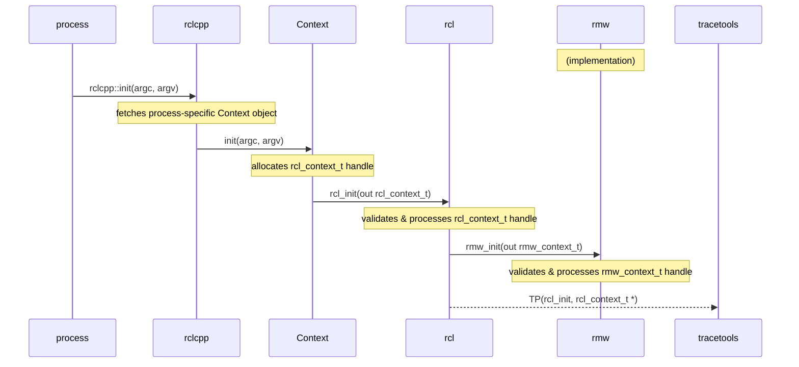

#### Node/component creation

In ROS 2, a process can contain multiple nodes. These are sometimes referred to as "components."

These components are instanciated by the containing process. They are usually classes that extend `rclcpp::Node`, so that the node initialization work is done by the parent constructor.

This parent constructor will allocate its own `rcl_node_t` handle and call `rcl_node_init()`, which will validate the node name/namespace. `rcl` will also call `rmw_create_node()` to get the node's `rmw` handle (`rmw_node_t`). This will be used later by publishers and subscriptions.

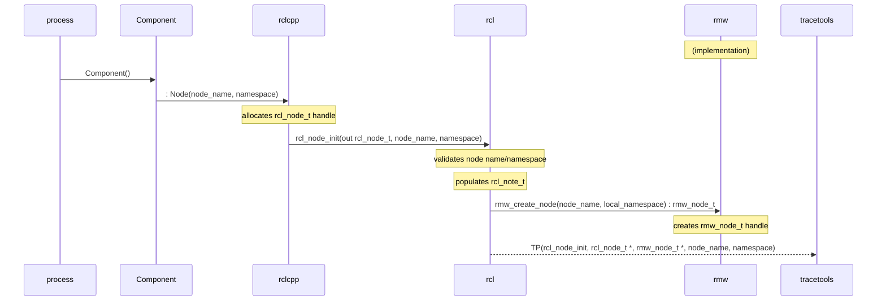

#### Publisher creation

The component calls `create_publisher()`, a `rclcpp::Node` method for convenience. That ends up creating an `rclcpp::Publisher` object which extends `rclcpp::PublisherBase`. The latter allocates an `rcl_publisher_t` handle, fetches the corresponding `rcl_node_t` handle, and calls `rcl_publisher_init()` in its constructor. `rcl` does topic name expansion/remapping/validation. It creates an `rmw_publisher_t` handle by calling `rmw_create_publisher()` of the given `rmw` implementation and associates with the node's `rmw_node_t` handle and the publisher's `rcl_publisher_t` handle.

If intra-process publishing/subscription is enabled, it will be set up after creating the publisher object, through a call to `PublisherBase::setup_intra_process()`, which calls `rcl_publisher_init()`.

#### Subscription creation

Subscription creation is done in a very similar manner.

The componenent calls `create_publisher()`, which ends up creating an `rclcpp::Subscription` object which extends `rclcpp::SubscriptionBase`. The latter allocates an `rcl_subscription_t` handle, fetches its `rcl_node_t` handle, and calls `rcl_subscription_init()` in its constructor. `rcl` does topic name expansion/remapping/validation. It creates an `rmw_subscription_t` handle by calling `rmw_create_subscription()` of the given `rmw` implementation and associates it with the node's `rmw_node_t` handle and the subscription's `rcl_subscription_t` handle.

If intra-process publishing/subscription is enabled, it will be set up after creating the subscription object, through a call to `Subscription::setup_intra_process()`, which calls `rcl_subscription_init()`. This is very similar to a normal (inter-process) subscription, but it sets some flags for later.

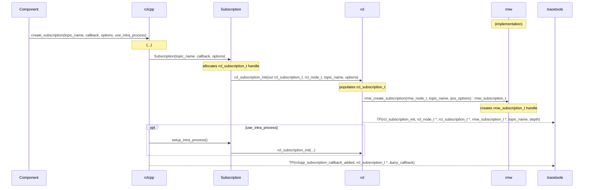

#### Executors

An `rclcpp::executor::Executor` object is created for a given process. It can be a `SingleThreadedExecutor` or a `MultiThreadedExecutor`.

Components are instanciated, usually as a `shared_ptr` through `std::make_shared<Component>()`, then added to the executor with `Executor::add_node()`.

After all the components have been added, `Executor::spin()` is called. `SingleThreadedExecutor::spin()` simply loops forever until the process' context isn't valid anymore. It fetches the next `rclcpp::AnyExecutable` (e.g. subscription, timer, service, client), and calls `Executor::execute_any_executable()` with it. This then calls the relevant `execute*()` method (e.g. `execute_timer()`, `execute_subscription()`, `execute_intra_process_subscription()`, `execute_service()`, `execute_client()`).

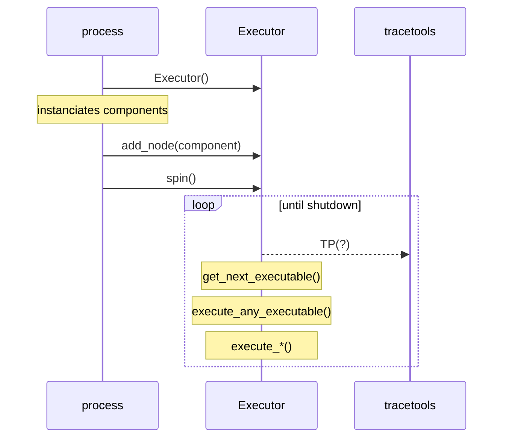

#### Subscription callbacks

Subscriptions are handled in the `rclcpp` layer. Callbacks are wrapped by an `rclcpp::AnySubscriptionCallback` object, which is registered when creating the `rclcpp::Subscription` object.

In `execute_*subscription()`, the `Executor` asks the `Subscription` to allocate a message though `Subscription::create_message()`. It then calls `rcl_take*()`, which calls `rmw_take_with_info()`. If that is successful, the `Executor` then passes that on to the subscription through `rclcpp::SubscriptionBase::handle_message()`. This checks if it's the right type of subscription (i.e. inter vs. intra process), then it calls `dispatch()` on the `rclcpp::AnySubscriptionCallback` object with the message (cast to the actual type). This calls the actual `std::function` with the right signature.

Finally, it returns the message object through `Subscription::return_message()`.

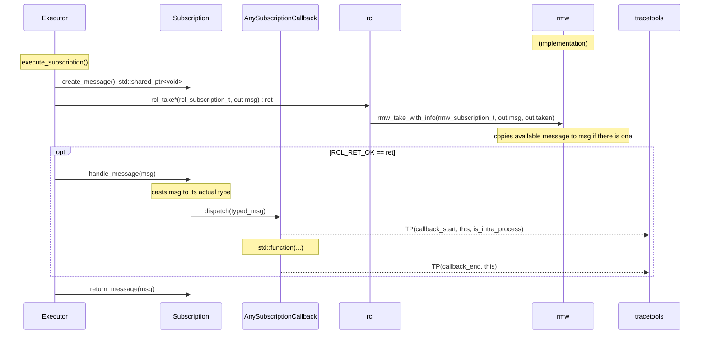

#### Message publishing

To publish a message, an object is first allocated and then populated by the `Component` (or equivalent). Then, the message is sent to the `Publisher` through `publish()`. This then passes that on to `rcl`, which itself passes it to `rmw`.

TODO add inter- vs. intra-process execution flow
TODO talk about IntraProcessManager stuff?

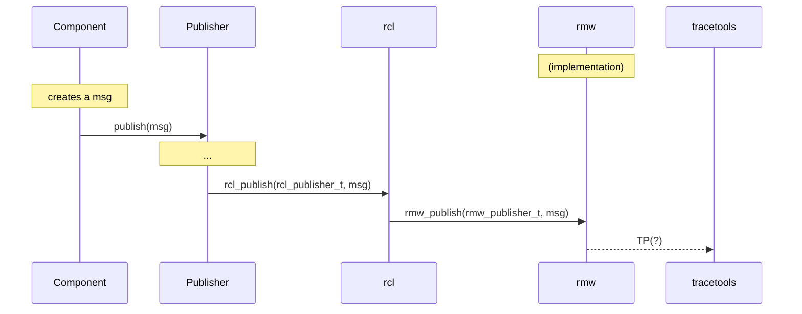

#### Service creation

Service server creation is similar to subscription creation. The `Component` calls `create_service()` which ends up creating a `rclcpp::Service`. In its constructor, it allocates a `rcl_service_t` handle, then calls `rcl_service_init()`. This processes the handle and validates the service name. It calls `rmw_create_service()` to get the corresponding `rmw_service_t` handle.

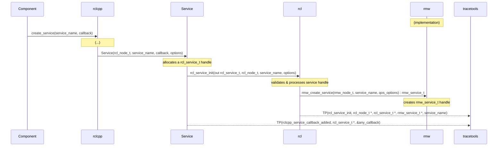

#### Service callbacks

Service callbacks are similar to subscription callbacks. In `execute_service()`, the `Executor` allocates request header and request objects. It then calls `rcl_take_request()` and passes them along with the service handle.

`rcl` calls `rmw_take_request()`. If those are successful, then the `Executor` calls `handle_request()` on the `Service`. This casts the request to its actual type, allocates a response object, and calls `dispatch()` on its `AnyServiceCallback` object, which calls the actual `std::function` with the right signature.

For the service response, `Service` calls `rcl_send_response()` which calls `rmw_send_response()`.

#### Client creation

Client creation is similar to publisher creation. The `Component` calls `create_client()` which ends up creating a `rclcpp::Client`. In its constructor, it allocates a `rcl_client_t` handle, then calls `rcl_client_init()`. This validates and processes the handle. It also calls `rmw_create_client()` which creates the `rmw_client_t` handle.

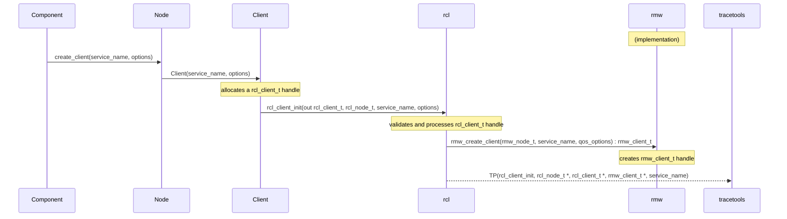

#### Client request

A client request has multiple steps. The `Component` (or the owner of the `Client`) first creates a request object. It then calls `Client::async_send_request()` with the request. It can also provide a callback, but it's optional. The `Client` passes that on to `rcl` by calling `rcl_send_request()`. `rcl` generates a sequence number and assigns it to the request, then calls `rmw_send_request()`. Once this is done, the `Client` puts this sequence number in an internal map along with the created promise and future objects, and the callback (which might simply be empty).

At this point, the `Client` could simply let its callback be called. It can also use the future object returned by `async_send_request()`, and call `rclcpp::spin_until_future_complete()`. This waits until the future object is ready, or until timeout, and returns.

If this last call was successful, then the `Component` can get the result and do something with it.

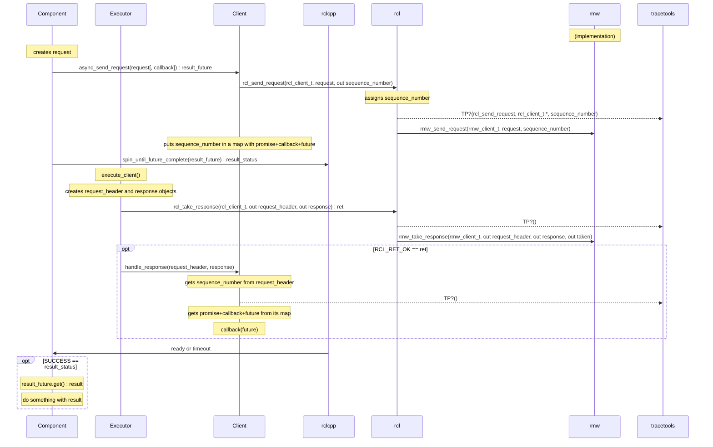

#### Timer creation

Timer creation is similar to subscription creation. The `Component` calls `create_service()` which ends up creating a `rclcpp::WallTimer`. In its constructor, it creates a `rclcpp::Clock` object, which (for a `WallTimer`) is simply a nanosecond clock. It then allocates a `rcl_timer_t` handle, then calls `rcl_timer_init()`. This processes the handle and validates the period.

Note that `rcl_timer_init()` can take a callback as a parameter, but right now that feature is not used anywhere (`nullptr` is given), and callbacks are instead handled in the `rclcpp` layer.

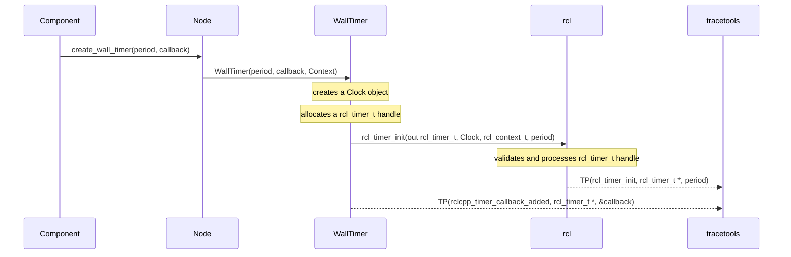

#### Timer callbacks

Timer callbacks are similar to susbcription callbacks. In `execute_timer()`, the `Executor` calls `execute_callback()` on the `WallTimer`. The timer then calls `rcl_timer_call()` with its `rcl_timer_t` handle and checks if the callback should be called.

If it that is the case, then the timer will call the actual `std::function`. Depending on the `std::function` that was given when creating the timer, it will either call the callback without any parameters or it will pass a reference of itself.

## Design & implementation notes

### Targeted tools/dependencies

The targeted tools or dependencies are:

* LTTng for tracing
* pandas and Jupyter for analysis & visualization

### Design

The plan is to use LTTng with a ROS wrapper package like `tracetools` for ROS 1. The suggested setup is:

* a tracing package (e.g. `tracetools`) wraps calls to LTTng
* ROS 2 is instrumented with calls to the tracing package, therefore it becomes a dependency and ships with the core stack
* by default, the tracing package's functions are empty -- they do not do anything
* if users wants to enable tracing, they need to
    * install LTTng
    * compile the tracing package from source, setting the right compile flag(s)
    * overlay it on top of their ROS 2 installation
* use other package(s) for analysis and visualization

## Architecture

### Timeline

The first goal is to statically instrument ROS 2, aiming for it to be in the ROS 2 E-turtle release (Nov 2019).

This includes transposing the existing ROS 1 instrumentation to ROS 2, wherever applicable. This step may not include instrumenting DDS implementations, and thus may be limited to the layer(s) right before `rmw`.

### Notes on client libraries

ROS offer a client library (`rcl`) written in C as the base for any language-specific implementation, such as `rclcpp` and `rclpy`.

However, `rcl` is obviously fairly basic, and still does leave a fair amount of implementation work up to the client libraries. For example, callbacks are not handled in `rcl`, and are left to the client library implementations.

This means that some instrumentation work will have to be re-done for every client library that we want to trace. We cannot simply instrument `rcl`, nor can we only instrument the base `rmw` interface if we want to dig into that.

This effort should first focus on `rcl` and `rclcpp` , but `rclpy` should eventually be added and supported.

### ROS 1/2 compatibility

We could look into making analyses work on both ROS 1 and ROS 2, through a common instrumentation interface (or other abstraction).

## Tools packages

* `tracetools_trace`
    * wraps the LTTng Python bindings to setup and start a tracing session
    * exposes simplified setup functions with default values
    * provides an example `trace` entrypoint for tracing
        * `$ ros2 run tracetools_trace trace`
* `ros2trace`
    * provides a `ros2cli` extension
    `$ ros2 trace`
        * uses `tracetools_trace` functions
* `tracetools_launch`
    * provides a `Trace` action for `launch`
        * uses `tracetools_trace` functions
* `tracetools_read`
    * wraps the babeltrace Python bindings to read CTF traces
* `tracetools_test`
    * provides a `TraceTestCase` class extending `unittest.TestCase`
        * uses the `Trace` action with `launch` to trace the test nodes
        * provides trace-specific utility functions (e.g. assert)
* `tracetools_analysis`
    * uses `tracetools_read` to read traces
    * provides utilities to:
        * convert CTF traces to pickle files
        * wrap trace events in Python `dict`
        * handle and process trace events to gather data
* `ros2trace_analysis`
    * provides a `ros2cli` extension with verbs
        * `$ ros2 trace-analysis`
    * uses/exposes `tracetools_analysis` functions
        * `$ ros2 trace-analysis convert`
        * `$ ros2 trace-analysis process`

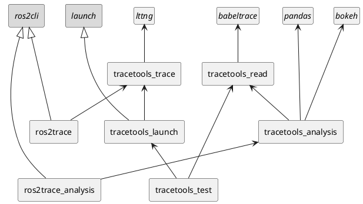

## Analysis

### Analysis design

Generally, for a given trace data analysis objective, the following classes are extended: `EventHandler`, `DataModel`, and `DataModelUtil`.

A user/developer can implement an `EventHandler`, which defines callbacks for specific events. Those callbacks get called by the `Processor`, and end up putting slightly-processed data into a `DataModel`, which is a data container that uses `pandas` `DataFrame`s.

Meaningful data can be extracted from the `DataModel`. However, a `DataModelUtil` can provide common utility functions so that users don't have to re-write them. This meaningful output data can then be presented through a Jupyter notebook (e.g. plots) or a normal Python script (e.g. tables).

### Analysis architecture

With profiling as an example implementation:

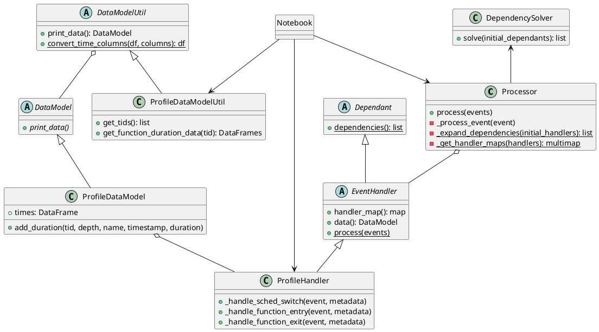
