# `ros2_tracing`

Design document for the general ROS 2 instrumentation, tracing, and analysis effort, which includes [`ros2_tracing`](https://github.com/ros2/ros2_tracing), a collection of flexible tracing tools and multipurpose instrumentation for ROS 2.

**Table of contents**
1. [Introduction](#introduction)
1. [Goals and requirements](#goals-and-requirements)
    1. [Goals](#goals)
    1. [Requirements: instrumentation](#requirements-instrumentation)
    1. [Requirements: analysis & visualization](#requirements-analysis-visualization)
    1. [Tools/accessibility](#toolsaccessibility)
1. [Instrumentation design](#instrumentation-design)
    1. [General guidelines](#general-guidelines)
    1. [Flow description](#flow-description)
        1. [Process creation](#process-creation)
        1. [Node/component creation](#nodecomponent-creation)
        1. [Publisher creation](#publisher-creation)
        1. [Subscription creation](#subscription-creation)
        1. [IntraProcessBuffer creation](#intraprocessbuffer-creation)
        1. [Executors](#executors)
        1. [Subscription callbacks](#subscription-callbacks)
        1. [Intra-process callback](#intra-process-callback)
        1. [Message publishing](#message-publishing)
        1. [Intra-process message publishing](#intra-process-message-publishing)
        1. [Service creation](#service-creation)
        1. [Service callbacks](#service-callbacks)
        1. [Client creation](#client-creation)
        1. [Client request/response](#client-requestresponse)
        1. [Timer creation](#timer-creation)
        1. [Timer callbacks](#timer-callbacks)
        1. [State machine creation](#state-machine-creation)
        1. [State machine transitions](#state-machine-transitions)
1. [Design & implementation notes](#design-implementation-notes)
    1. [Targeted tools/dependencies](#targeted-toolsdependencies)
    1. [Design](#design)
    1. [Adding instrumentation](#adding-instrumentation)
1. [Architecture](#architecture)
    1. [Notes on client libraries](#notes-on-client-libraries)
    1. [ROS 1/2 compatibility](#ros-12-compatibility)
1. [Tools packages](#tools-packages)
1. [Analysis](#analysis)
    1. [Analysis design](#analysis-design)
    1. [Analysis architecture](#analysis-architecture)

## Introduction

Tracing allows to record run-time data from a system, both for system data (e.g., when a process is being scheduled, or when I/O occurs) and for user-defined data.
This tool helps with user-defined trace data within the ROS 2 framework, e.g., to trace when messages arrive, when timers fire, when callbacks are being run, etc.

## Goals and requirements

### Goals

1. Provide low-overhead tools and resources for robotics software development based on ROS 2.
2. Make tracing easier to use with ROS.

### Requirements: instrumentation

Instrumentation should be built around the main uses of ROS 2, and should include relevant information:

1. Overall
    1. When creating a publisher/subscriber/service/client/etc., appropriate references should be kept in order to correlate with other tracepoints related to the same instance.
1. Publishers & subscriptions
    1. When creating a publisher/subscription:
        1. the effective topic name should be included (i.e., including namespace and after remapping).
        1. information about the publisher/subscription instances should be included, to be correlated with other tracepoints later.
    1. When publishing a message:
        1. it should be linked to its publisher.
        1. some sort of message identifier(s) should be included in the tracepoint so it can be tracked through DDS up to the subscriber's side.
            * A pointer to the message can be used to track it through the ROS abstraction layers.
            * Same for DDS, making sure to track any copies being made, if any.
            * Some logic, e.g., network packet matching or some sort of unique message identifier, can then be used to link a published message to a message received by a subscription.
1. Callbacks (subscription, service, client, timer)
    1. Callback function symbol should be included, whenever possible.
    1. Callback instances should be linked to a specific message or request, when applicable.
    1. Information about callback execution (e.g., start & end) should be available.
1. Timers
    1. Information about the period should be available.
1. Executors
    1. Information about spin cycles & periods should be available.
1. Others
    1. Provide generic tracepoints for user code.

### Requirements: analysis & visualization

Analyses process trace data.
They should be general enough to be useful for different use-cases, e.g.:

* Callback duration
* Time between callbacks (between two callback starts and/or a callback end and a start)
* Message age (as the difference between processing time and message timestamp)
* Message size
* Memory usage
* Execution time/proportion accross a process' nodes/components
* Interruptions (noting that these may be more useful as time-based metrics instead of overall statistics):
    * scheduling events during a callback
    * delay between the moment a thread becomes ready and when it's actually scheduled
    * CPU cycles

with mean, stdev, etc. when applicable.

Generic tracepoints for ROS 2 user code could be applied to a user-provided model for higher-level behaviour statistics and visualization.

### Tools/accessibility

To make tracing ROS 2 more accessible and easier to adopt, we can put effort into integrating LTTng session setup & recording into the ROS 2 launch system and command line interface.

This might include converting existing `tracetools` scripts to more flexible Python scripts, and then plugging that into the launch system and creating a `ros2cli` extension.

## Instrumentation design

This section includes information about ROS 2's design & architecture through descriptions of the main execution flows.
The instrumentation can then be built around that.

The following table summarizes the instrumentation and links to the corresponding subsections.

| Layer    | Instrumentation Point                | Ref |
|   :--:   | :--                                  | :-- |
| `rclcpp` | `rclcpp_subscription_init`           | [*Subscription creation*](#subscription-creation) |
|          | `rclcpp_subscription_callback_added` | [*Subscription creation*](#subscription-creation) |
|          | `rclcpp_publish`                     | [*Message publishing*](#message-publishing) |
|          | `rclcpp_intra_publish`               | [*Intra-process message publishing*](#intra-process-message-publishing) |
|          | `rclcpp_take`                        | [*Subscription callbacks*](#subscription-callbacks) |
|          | `rclcpp_service_callback_added`      | [*Service creation*](#service-creation) |
|          | `rclcpp_timer_callback_added`        | [*Timer creation*](#timer-creation) |
|          | `rclcpp_timer_link_node`             | [*Timer creation*](#timer-creation) |
|          | `rclcpp_callback_register`           | [*Subscription creation*](#subscription-creation), [*Service creation*](#service-creation), [*Timer creation*](#timer-creation) |
|          | `callback_start`                     | [*Subscription callbacks*](#subscription-callbacks), [*Service callbacks*](#service-callbacks), [*Client request/response*](#client-requestresponse), [*Timer callbacks*](#timer-callbacks) |
|          | `callback_end`                       | [*Subscription callbacks*](#subscription-callbacks), [*Service callbacks*](#service-callbacks), [*Client request/response*](#client-requestresponse), [*Timer callbacks*](#timer-callbacks) |
|          | `rclcpp_construct_ring_buffer`       | [*IntraProcessBuffer creation*](#intraprocessbuffer-creation) |
|          | `rclcpp_buffer_to_ipb`               | [*IntraProcessBuffer creation*](#intraprocessbuffer-creation) |
|          | `rclcpp_ipb_to_subscription`         | [*IntraProcessBuffer creation*](#intraprocessbuffer-creation) |
|          | `rclcpp_ring_buffer_enqueue`         | [*Intra-process message publishing*](#intra-process-message-publishing) |
|          | `rclcpp_ring_buffer_dequeue`         | [*Intra-process callback*](#intra-process-callback) |
|          | `rclcpp_ring_buffer_clear`           | [*IntraProcessBuffer creation*](#intraprocessbuffer-creation) |
|          | `rclcpp_executor_get_next_ready`     | [*Executors*](#executors) |
|          | `rclcpp_executor_wait_for_work`      | [*Executors*](#executors) |
|          | `rclcpp_executor_execute`            | [*Executors*](#executors), [*Timer callbacks*](#timer-callbacks), [*Subscription callbacks*](#subscription-callbacks) |
| `rcl`    | `rcl_init`                           | [*Process creation*](#process-creation) |
|          | `rcl_node_init`                      | [*Node/component creation*](#nodecomponent-creation) |
|          | `rcl_publisher_init`                 | [*Publisher creation*](#publisher-creation) |
|          | `rcl_subscription_init`              | [*Subscription creation*](#subscription-creation) |
|          | `rcl_publish`                        | [*Message publishing*](#message-publishing) |
|          | `rcl_take`                           | [*Subscription callbacks*](#subscription-callbacks) |
|          | `rcl_client_init`                    | [*Client creation*](#client-creation) |
|          | `rcl_service_init`                   | [*Service creation*](#service-creation) |
|          | `rcl_timer_init`                     | [*Timer creation*](#timer-creation) |
|          | `rcl_lifecycle_state_machine_init`   | [*State machine creation*](#state-machine-creation) |
|          | `rcl_lifecycle_transition`           | [*State machine transitions*](#state-machine-transitions) |
| `rmw`    | `rmw_publisher_init`                 | [*Publisher creation*](#publisher-creation) |
|          | `rmw_subscription_init`              | [*Subscription creation*](#subscription-creation) |
|          | `rmw_publish`                        | [*Message publishing*](#message-publishing) |
|          | `rmw_take`                           | [*Subscription callbacks*](#subscription-callbacks) |

### General guidelines

Instrumentation points can be split into two types: initialization events and runtime events.
The former collect one-time information about the state of objects, e.g., creation of publishers, subscriptions, and services.
The latter collect information about events throughout the runtime, e.g., message publication and callback execution.
The former are therefore predominantly triggered on system initialization and are used to minimize the payload size of the latter to minimize overhead in the runtime phase.
The information that is collected to form the trace data can then be used to build a model of the execution.
Due to the very abstractional nature of the ROS 2 architecture, multiple instrumentation points are sometimes needed to gather the necessary information.
Both the instrumentation point name and the payload can be meaningful: some instrumentation points only differ by their names and are used to indicate the originating layer.

### Flow description

This subsection contains descriptions of the main execution flows using text and sequence diagrams.
These diagrams include the instrumentation points as calls to `tracetools`.
Instrumentation point calls with a question mark (`TP?()`) are not currently implemented.

Each execution flow also has a list of important information that should be collected.
These lists roughly correspond to and fulfill the [instrumentation requirements](#requirements-instrumentation) and follows the [guidelines](#general-guidelines).
All of this therefore serves as support for instrumentation design decisions.

#### Process creation

In the call to `rclcpp::init()`, a process-specific `rclcpp::Context` object is fetched and CLI arguments are parsed.
Much of the work is actually done by `rcl` through a call to `rcl_init()`.
This call processes the `rcl_context_t` handle, which is wrapped by the `Context` object.
Also, inside this call, `rcl` calls `rmw_init()` to process the `rmw` context (`rmw_context_t`) as well.
This `rmw` handle is itself part of the `rcl_context_t` handle.

This has to be done once per process, and usually at the very beginning.
The components that are then instanciated share this context.

**Important information**:
* `tracetools` version

#### Node/component creation

In ROS 2, a process can contain multiple nodes.
These are sometimes referred to as "components."

These components are instanciated by the containing process.
They are usually classes that extend `rclcpp::Node`, so that the node initialization work is done by the parent constructor.

This parent constructor will allocate its own `rcl_node_t` handle and call `rcl_node_init()`, which will validate the node name/namespace.
`rcl` will also call `rmw_create_node()` to get the node's `rmw` handle (`rmw_node_t`).
This will be used later by publishers and subscriptions.

**Important information**:
* Link between `rcl_node_t` and `rmw_node_t` handles
* Link between node handle(s)
* Node name and node namespace

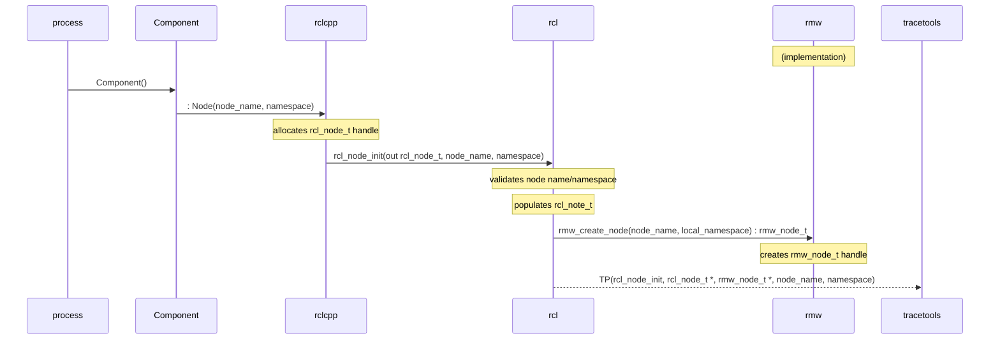

#### Publisher creation

The node calls `rclcpp::create_publisher()`.
That ends up creating an `rclcpp::Publisher` object which extends `rclcpp::PublisherBase`.
The latter allocates an `rcl_publisher_t` handle, fetches the corresponding `rcl_node_t` handle, and calls `rcl_publisher_init()` in its constructor.
`rcl` does topic name expansion/remapping/validation.
It creates an `rmw_publisher_t` handle by calling `rmw_create_publisher()` of the given `rmw` implementation and associates it with the node's `rmw_node_t` handle and the publisher's `rcl_publisher_t` handle.
`rmw` associates the `rmw_publisher_t` handle with the underlying DDS object's GID.

<!-- Note: there is an optional intra-process setup step, but it might not be relevant on the publisher side. -->

**Important information**:
* Link between `rcl_publisher_t` and `rmw_publisher_t` handles
* Link to underlying DDS object's GID
* Link to corresponding node handle
* Topic name
* *Some* QoS information

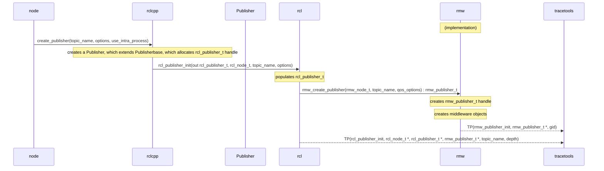

#### Subscription creation

Subscription creation is done in a very similar manner.

The node calls `rclcpp::create_publisher()`, which ends up creating an `rclcpp::Subscription` object which extends `rclcpp::SubscriptionBase`.
The latter allocates an `rcl_subscription_t` handle, fetches its `rcl_node_t` handle, and calls `rcl_subscription_init()` in its constructor.
`rcl` does topic name expansion/remapping/validation.
It creates an `rmw_subscription_t` handle by calling `rmw_create_subscription()` of the given `rmw` implementation and associates it with the node's `rmw_node_t` handle and the subscription's `rcl_subscription_t` handle.
`rmw` associates the `rmw_subscription_t` handle with the underlying DDS object's GID.
`rclcpp::Subscription` creates an `rclcpp::AnySubscriptionCallback` object and associates it with itself.

If intra-process is enabled, `rclcpp::Subscription` also creates a `rclcpp::SubscriptionIntraProcess` object, which has its own `rclcpp::AnySubscriptionCallback` object.
See the [IntraProcessBuffer creation section](#intraprocessbuffer-creation).

**Important information**:
* Link between `rcl_subscription_t` and `rmw_subscription_t` handles and `rclcpp::Subscription` object
* Link between `rcl_subscription_t` and `rclcpp::SubscriptionIntraProcess` object
* Link to callback object(s), with callback function symbol string
* Link to underlying DDS object's GID
* Link to corresponding node handle
* Topic name
* *Some* QoS information

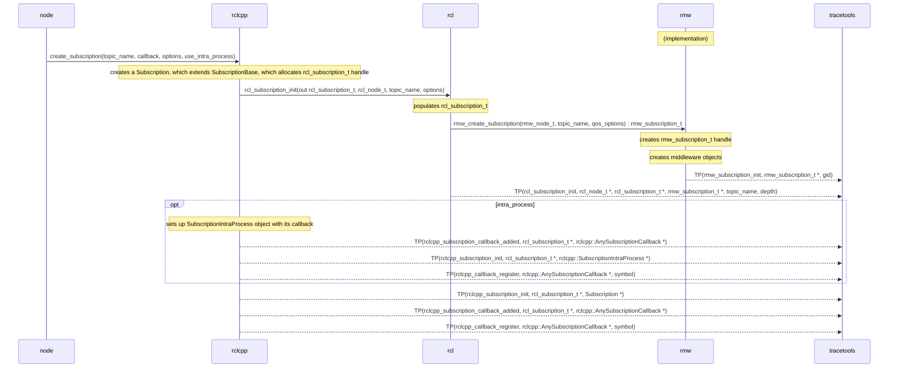

#### IntraProcessBuffer creation

The initialization process for the buffer used in intra-process communication is performed as part of the [initialization process for the subscription](#subscription-creation).
First, the `rclcpp::SubscriptionIntraProcess` that is responsible for managing intra-process communication is created.
It then creates an instance of `rclcpp::experimental::SubscriptionIntraProcessBuffer` using the `rclcpp::experimental::create_intra_process_buffer()` function.
This function creates a `rclcpp::experimental::buffers::TypedIntraProcessBuffer` object with a `rclcpp::experimental::buffers::RingBufferImplementation`.
The initialization of intra-process communication is completed by registering the settings related to the intra-process communication generated above using `rclcpp::SubscriptionBase::setup_intra_process()`.

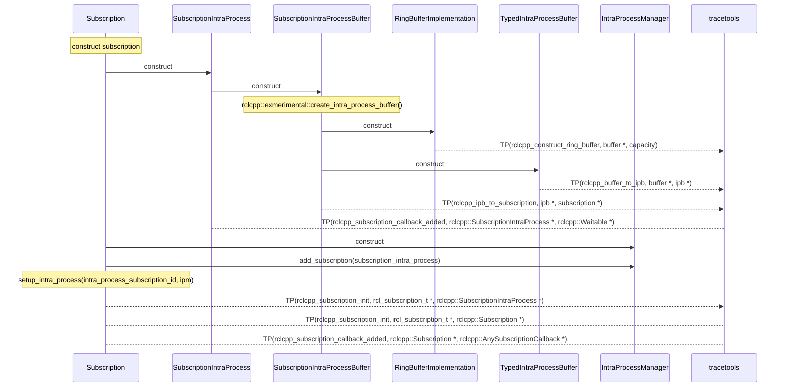

#### Executors

An `rclcpp::Executor` object is created for a given process.
It can be a `rclcpp::executors::SingleThreadedExecutor` or a `rclcpp::executors::MultiThreadedExecutor`, with the former currently being the default.

Nodes are instanciated, usually as a `shared_ptr` through `std::make_shared<Node>()`, then added to the executor with `rclcpp::Executor::add_node()`.

After all the nodes have been added, `rclcpp::Executor::spin()` is called (there are other spinning varations, but this is the main one).
`rclcpp::executors::SingleThreadedExecutor::spin()` simply loops forever until the process' context isn't valid anymore.
It fetches the next `rclcpp::AnyExecutable` (e.g., subscription, timer, service, client), possibly waiting a bit, and calls `rclcpp::Executor::execute_any_executable()` with it.
This then calls the relevant `execute*()` method (e.g., [`execute_timer()`](#timer-callbacks), [`execute_subscription()`](#subscription-callbacks), `execute_service()`, `execute_client()`, `Waitable::execute()`).

**Important information**:
* Timestamps of executor phases
* Link to handle of object being executed (e.g., timer, subscription)

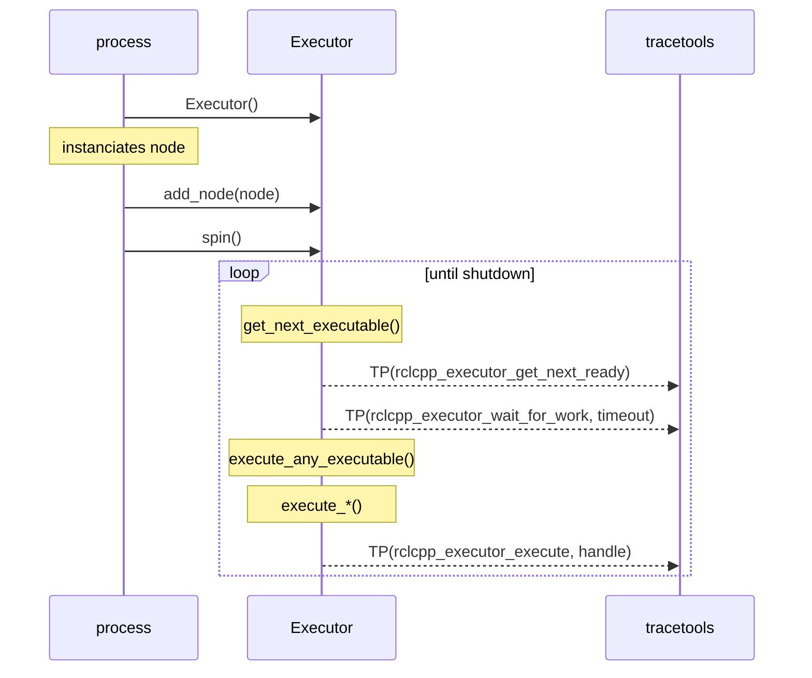

#### Subscription callbacks

Subscriptions are handled in the `rclcpp` layer.
Callback functions are wrapped by an `rclcpp::AnySubscriptionCallback` object, which is [registered when creating the `rclcpp::Subscription` object](#subscription-creation).

In [`rclcpp::Executor::execute_subscription()`, the `rclcpp::Executor`](#executors) asks the `rclcpp::Subscription` to allocate a message though `rclcpp::SubscriptionBase::create_message()` (there are other ways to get/allocate messages, like loaning, but this is the main one).
It then calls `rcl_take*()`, which calls `rmw_take_with_info()`, which gets the message from the underlying middleware.
If that is successful, the `rclcpp::Executor` then passes that on to the subscription through `rclcpp::SubscriptionBase::handle_message()`.
This checks if it's the right type of subscription (i.e., inter vs. intra process), and then it calls `rclcpp::AnySubscriptionCallback::dispatch()` on its callback object with the message (cast to the actual type).
This calls the actual `std::function` with the right signature.

Finally, it returns the message object through `rclcpp::SubscriptionBase::return_message()`.
For simple messages without loaning, it simply gets deallocated.

**Important information**:
* Link to handle(s) of subscription being executed
* Message being taken
* Source timestamp of message being taken
* Link to callback object being dispatched, with start/end timestamps
* Whether the callback dispatching is for intra-process or not

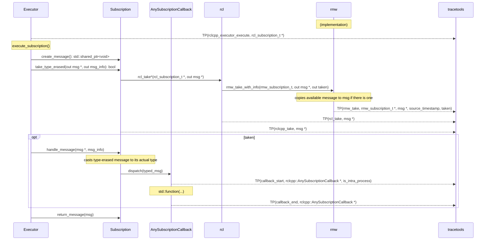

#### Intra-process callback

Intra-process subscriptions are handled in the `rclcpp` layer.
Callback functions are wrapped by an `rclcpp::Waitable` object (i.e., the `rclcpp::SubscriptionIntraProcess` object), which is registered when creating the `rclcpp::Subscription` object.

In `rclcpp::Executor::get_next_ready_executable_from_map()`, the `rclcpp::Executor` checks for new intra-process messages.
If there is a new message, it calls `rclcpp::SubscriptionIntraProcess::take_data()`, which calls `rclcpp::IntraProcessBuffer::consume_*()` (e.g., `consume_share()`, `consume_unique()`), which in turn calls `rclcpp::BufferImplementationBase::dequeue()` to get the message from the intra-process buffer.
Then, in `rclcpp::Executor::get_next_ready_executable(any_exec)`, the executor calls `rclcpp::Waitable::execute()` with the message, which is actually `rclcpp::SubscriptionIntraProcess::execute()`.
This checks message is `shared_ptr` or `unique_ptr`, and then it calls `rclcpp::SubscriptionIntraProcess::dispatch_intra_process()`, which then calls the callback `std::function`.
Finally, the callback group (`any_exec.callback_group`) is reset.

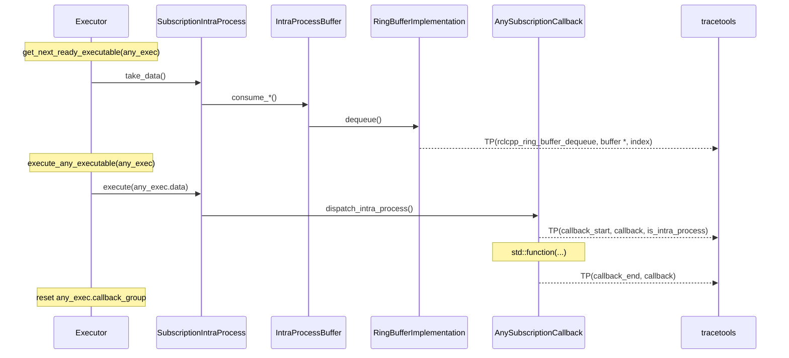

#### Message publishing

To publish a message, a message object is first allocated (or loaned) and then populated at the user level (e.g., in a node).
The message is then published through one of the `rclcpp::Publisher::publish()` methods.
For normal inter-process publishing, this then passes that on to `rcl`, which itself passes it to `rmw`, which passes it on to the underlying middleware.

**Important information**:
* Link to publisher handle(s)
* Message being published, with its timestamp

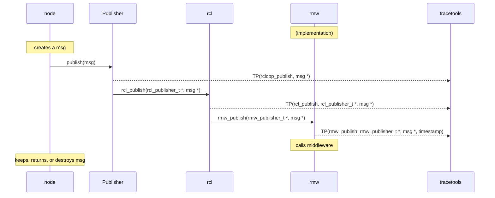

#### Intra-process message publishing

To publishing a message in intra-process, a message object is first allocated (or loaned) and then populated at the user level (e.g., in a node).
The message is then published through one of the `rclcpp::Publisher::publish()` methods.

For normal intra-process publishing, this then passes that on to `rclcpp::IntraProcessManager`, which itself passes it to `rclcpp::TypedIntraProcessBuffer`, which passes it on to the `rclcpp::RingBufferImplementation`.
In `rclcpp::RingBufferImplementation`, published data is stored by its `enqueue()` method.

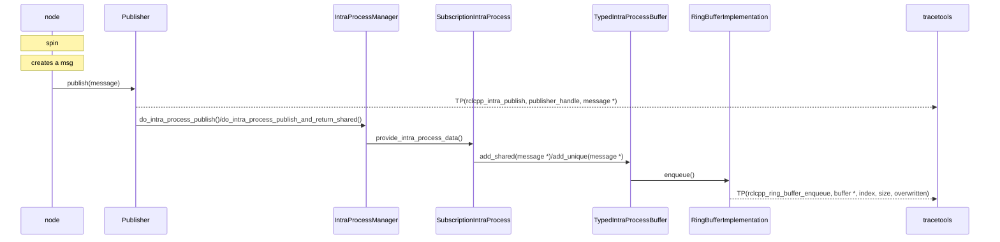

#### Service creation

Service server creation is similar to subscription creation.
The node calls `rclcpp::create_service()` which ends up creating a `rclcpp::Service`.
In its constructor, it allocates a `rcl_service_t` handle, and then calls `rcl_service_init()`.
This processes the handle and validates the service name.
It calls `rmw_create_service()` to get the corresponding `rmw_service_t` handle.
`rclcpp::Service` creates an `rclcpp::AnySubscriptionCallback` object and associates it with itself.

**Important information**:
* Link between `rcl_service_t` and `rmw_service_t` handles
* Link to callback object, with callback function symbol string
* Link to corresponding node handle
* Service name

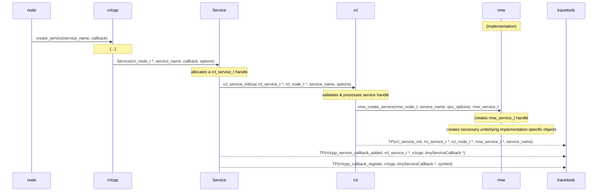

#### Service callbacks

Service callbacks are similar to subscription callbacks.
In `rclcpp::Executor::execute_service()`, the `rclcpp::Executor` allocates request header and request objects.
It then calls `rclcpp::Service::take_type_erased_request()`, which calls `rcl_take_request()` & `rmw_take_request()`.

If those are successful and a new request is taken, then the `rclcpp::Executor` calls `rclcpp::Service::handle_request()` with the request.
This casts the request to its actual type, allocates a response object, and calls `rclcpp::AnyServiceCallback::dispatch()`, which calls the actual `std::function` with the right signature.

If there is a service response for the request, `rclcpp::Service::send_response()` is called, which calls `rcl_send_response()` & `rmw_send_response()`.

**Important information**:
* Request being taken
* Link to callback object being dispatched, with start/end timestamps
* TODO
    * Link to handle(s) of service being executed
    * Source timestamp of request being taken
    * Link between request and response

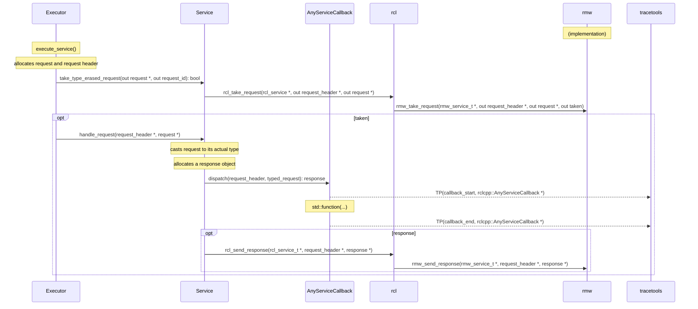

#### Client creation

Client creation is similar to publisher creation.
The node calls `rclcpp::create_client()` which ends up creating a `rclcpp::Client`.
In its constructor, it allocates a `rcl_client_t` handle, and then calls `rcl_client_init()`.
This validates and processes the handle.
It also calls `rmw_create_client()` which creates the `rmw_client_t` handle.

**Important information**:
* Link between `rcl_client_t` and `rmw_client_t` handles
* Link to corresponding node handle
* Service name

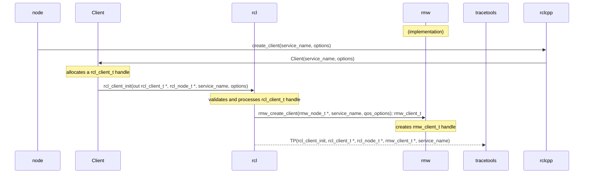

#### Client request/response

A client request has multiple steps.
The node (or the owner of the `rclcpp::Client`, at the user level) first creates a request object and populates it.
It then calls `rclcpp::Client::async_send_request()` with the request.
It can also provide a callback, but it's optional.
The `rclcpp::Client` passes that on to `rcl` by calling `rcl_send_request()`.
`rcl` generates a sequence number and assigns it to the request, then calls `rmw_send_request()`.
Once this is done, the `rclcpp::Client` puts this sequence number in an internal map along with the created promise and future objects, and the callback (which might simply be empty).

If a callback was provided when sending the request, the `rclcpp::Client` simply uses the executor to spin and lets its callback be called.
Otherwise, it uses the future object returned by `rclcpp::Client::async_send_request()`, and calls `rclcpp::spin_until_future_complete()`.
This waits until the future object is ready, or until timeout, and returns.
If this last call was successful, then the node can get the result (i.e., response) and do something with it.

**Important information**:
* TODO
    * Link to handle(s) of client
    * Request being sent, with timestamp
    * Link to callback object being used, with start/end timestamps
    * Response being taken
    * Source timestamp of response being taken
    * Link to response

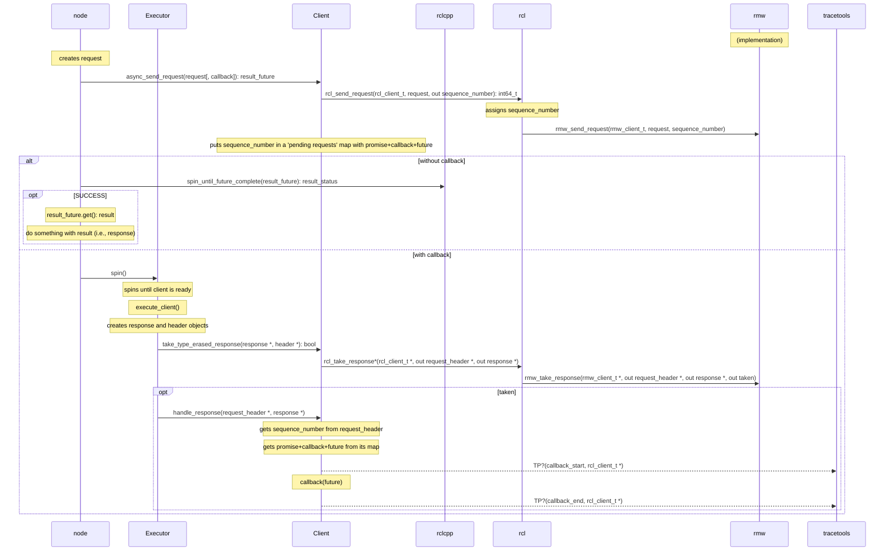

#### Timer creation

Timer creation is similar to subscription creation.
The node calls `rclcpp::create_wall_timer()` which ends up creating a `rclcpp::WallTimer`, which extends `rclcpp::GenericTimer`, which extends `rclcpp::TimerBase`.
In its constructor, it creates a `rclcpp::Clock` object, which (for a `rclcpp::WallTimer`) is simply a nanosecond clock.
It then allocates a `rcl_timer_t` handle, and then calls `rcl_timer_init()`.
This processes the handle and validates the period.
`rclcpp::GenericTimer` has its own callback.
Also, timers are not linked to any node at the `rcl` level.
They are only linked to nodes at the `rclcpp` level in `rclcpp::create_wall_timer()`, after being created.

Note that `rcl_timer_init()` can take a callback as a parameter, but right now that feature is not used anywhere (`nullptr` is given), and callbacks are instead handled in the `rclcpp` layer.

**Important information**:
* Timer handle
* Timer period
* Link to corresponding node handle
* Link to timer callback, with symbol

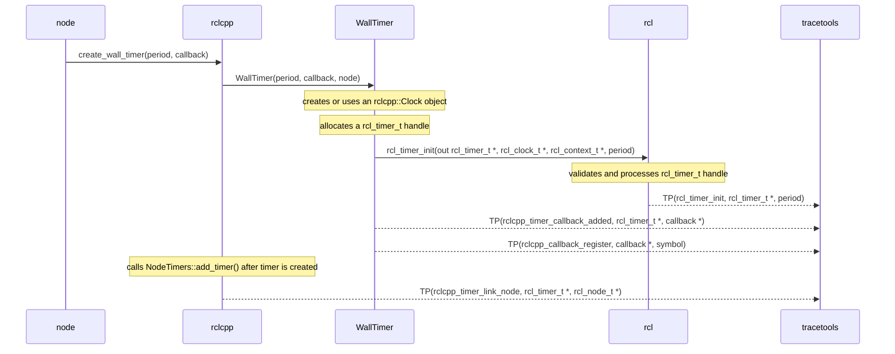

#### Timer callbacks

Timer callbacks are similar to susbcription callbacks.
The executor spins until the timer is ready.
Then the `rclcpp::Executor` calls `rclcpp::Executor::execute_timer()`, which calls `rclcpp::WallTimer::execute_callback()`.
This calls the actual callback `std::function`.
Depending on the `std::function` that was given when creating the timer, it will either call the callback without any parameters or it will pass a reference of itself.

**Important information**:
* Link to handle of timer being executed
* Link to timer callback object being executed, with start/end timestamps

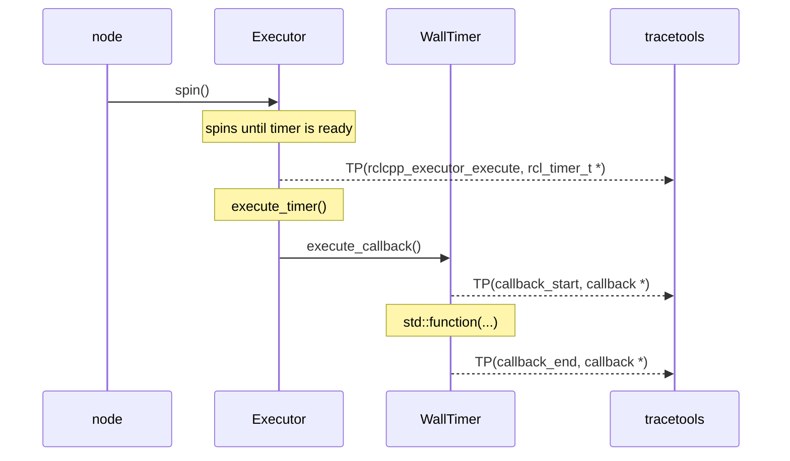

#### State machine creation

State machines are usually created when an `rclcpp::LifecycleNode` is initialized.
It calls `rcl_lifecycle_state_machine_init()`.

**Important information**:
* Link between state machine handle and node handle

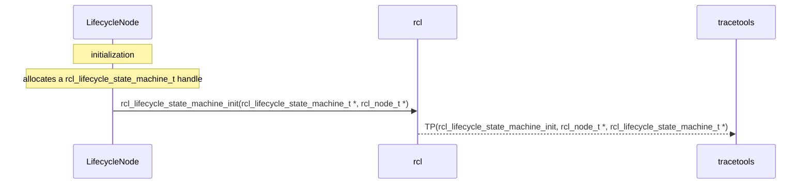

#### State machine transitions

State machine transitions are usually triggered by `rclcpp::LifecycleNode::trigger_transition()`, which are themselves triggered by `rclcpp::LifecycleNode`'s various standard state transition methods.

**Important information**:
* Link to handle of state machine being state-transitioned
* Start and goal labels (i.e., current state and next state, respectively)

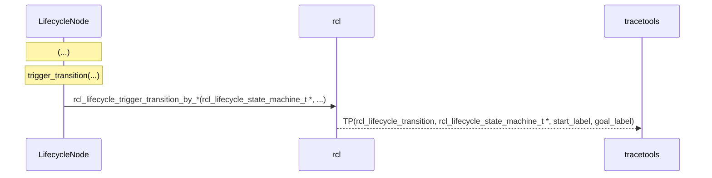

## Design & implementation notes

### Targeted tools/dependencies

The targeted tools or dependencies are:

* LTTng for tracing
* pandas and Jupyter for analysis & visualization

### Design

The plan is to use LTTng with a ROS wrapper package like `tracetools` for ROS 1.
The suggested setup is:

* a tracing package (e.g., `tracetools`) wraps calls to LTTng
* ROS 2 is instrumented with calls to the tracing package, therefore it becomes a dependency and ships with the core stack
* by default, the tracing package's functions are empty -- they do not do anything
* if users want to enable tracing, they need to
    * install LTTng
    * compile the tracing package from source, setting the right compile flag(s)
    * overlay it on top of their ROS 2 installation
* use other package(s) for analysis and visualization

### Adding instrumentation

The process for adding instrumentation to the ROS 2 core and supporting it in `ros2_tracing` is as follows:

1. Add LTTng tracepoint definition to the [`tp_call.h`](../tracetools/include/tracetools/tp_call.h) file
    * tracepoint name, arguments, and fields
    * arguments and fields are usually the same
    * refer to the [LTTng documentation](https://lttng.org/docs/#doc-defining-tracepoints)
1. Add corresponding instrumentation function definition to the [`tracetools.c`](../tracetools/src/tracetools.c) file
1. Add corresponding instrumentation function declaration to the [`racetools.h`](../tracetools/include/tracetools/tracetools.h) file
1. Add/use instrumentation in ROS 2 core package(s)
    1. If the package does not already have instrumentation
        1. Add `<depend>tracetools</depend>` in the package's `package.xml`
        1. Add `find_package(tracetools REQUIRED)` in the package's `CMakeLists.txt`
        1. Add `tracetools` to the list of dependencies in `ament_target_dependencies(...)` for the right executable/library in the package's `CMakeLists.txt`
        1. Add `ament_export_dependencies(tracetools)` in the package's `CMakeLists.txt` (if applicable)
    1. In the instrumented source code file
        1. Add call to tracepoint: `TRACEPOINT(tracepoint_name, arg1, arg2);`
        1. Add an include for the main `tracetools` header: `#include "tracetools/tracetools.h"`
1. Add tracepoint name to the [list of ROS 2 events in `tracetools_trace`](../tracetools_trace/tracetools_trace/tools/names.py)
1. Add/modify test in [`test_tracetools`](../test_tracetools/test) to cover the new tracepoint

Additional considerations:

* The pull request with the necessary changes in `ros2_tracing` is usually merged first, then a new release of the `ros2_tracing` is created before merging the pull request(s) for the corresponding downstream package(s) in the ROS 2 core
* For the `ros2_tracing` PR and until the PRs for the ROS 2 core package(s) are merged, local GitHub CI may need to use the modified version(s) of the core package(s) using a `.repos` file so that end-to-end tests pass (see `test_tracetools`)
* Add support for the new instrumentation in [`tracetools_analysis`](https://github.com/ros-tracing/tracetools_analysis)
    * Along with the end-to-end tests, this is usually a good way to demonstrate how the tracing data resulting from the new instrumentation is used and how useful it is

## Architecture

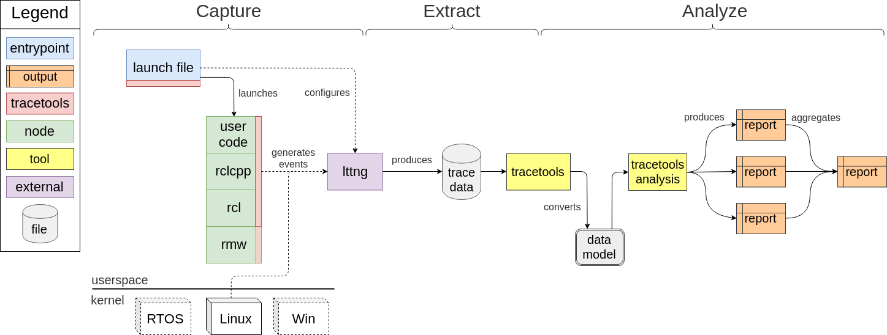

### Notes on client libraries

ROS 2 offers a client library written in C (`rcl`) as the base for any language-specific implementation, such as `rclcpp` and `rclpy`.
However, `rcl` is obviously fairly basic, and still does leave a fair amount of implementation work up to the client libraries.
For example, callbacks are not handled in `rcl`, and are left to the client library implementations.

This means that some instrumentation work will have to be re-done for every client library that we want to trace.
We cannot simply instrument `rcl`, nor can we only instrument the base `rmw` interface if we want to dig into that.

This effort should first focus on `rcl` and `rclcpp`.
`rclpy` could eventually be added and supported, although it is not used for the kind of applications that `ros2_tracing` targets.

### ROS 1/2 compatibility

We could look into making analyses work on both ROS 1 and ROS 2, through a common instrumentation interface (or other abstraction).

## Tools packages

* `tracetools_trace`
    * wraps the LTTng Python bindings to setup and start a tracing session
    * exposes simplified setup functions with default values
    * provides an example `trace` entrypoint for tracing
        * `$ ros2 run tracetools_trace trace`
* `ros2trace`
    * provides a `ros2cli` extension
    `$ ros2 trace`
        * uses `tracetools_trace` functions
* `tracetools_launch`
    * provides a `Trace` action for `launch`
        * uses `tracetools_trace` functions
* `tracetools_read`
    * wraps the babeltrace Python bindings to read CTF traces
* `tracetools_test`
    * provides a `TraceTestCase` class extending `unittest.TestCase`
        * uses the `Trace` action with `launch` to trace the test nodes
        * provides trace-specific utility functions (e.g., assert)
* `tracetools_analysis`
    * uses `tracetools_read` to read traces
    * provides utilities to:
        * convert CTF traces to pickle files
        * wrap trace events in Python `dict`
        * handle and process trace events to gather data
    * see [*Analysis*](#analysis)
* `ros2trace_analysis`
    * provides a `ros2cli` extension with verbs
        * `$ ros2 trace-analysis`
    * uses/exposes `tracetools_analysis` functions
        * `$ ros2 trace-analysis convert`
        * `$ ros2 trace-analysis process`

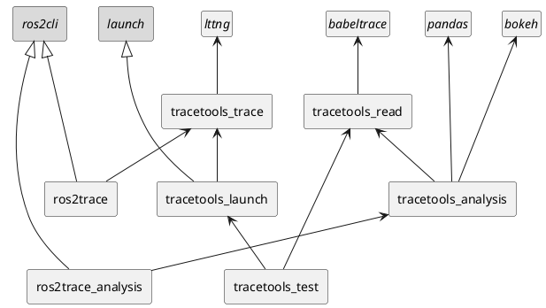

## Analysis

A number of existing tools or libraries could be leveraged to perform analysis on the trace data collected using `ros2_tracing` and LTTng.
This section presents a minimal analysis library architecture as a working proof-of-concept: [`tracetools_analysis`](https://github.com/ros-tracing/tracetools_analysis).

### Analysis design

Generally, for a given trace data analysis objective, the following classes are extended: `EventHandler`, `DataModel`, and `DataModelUtil`.

A user/developer can implement an `EventHandler`, which defines callbacks for specific events.
Those callbacks get called by the `Processor`, and end up putting slightly-processed data into a `DataModel`, which is a data container that uses `pandas` `DataFrame`s.

Meaningful data can be extracted from the `DataModel`.
However, a `DataModelUtil` can provide common utility functions so that users don't have to re-write them.
This meaningful output data can then be presented through a Jupyter notebook (e.g., plots) or a normal Python script (e.g., tables).

### Analysis architecture

With profiling as an example implementation:

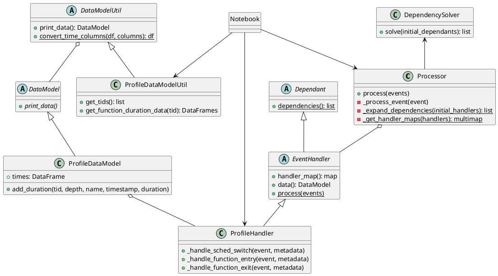
