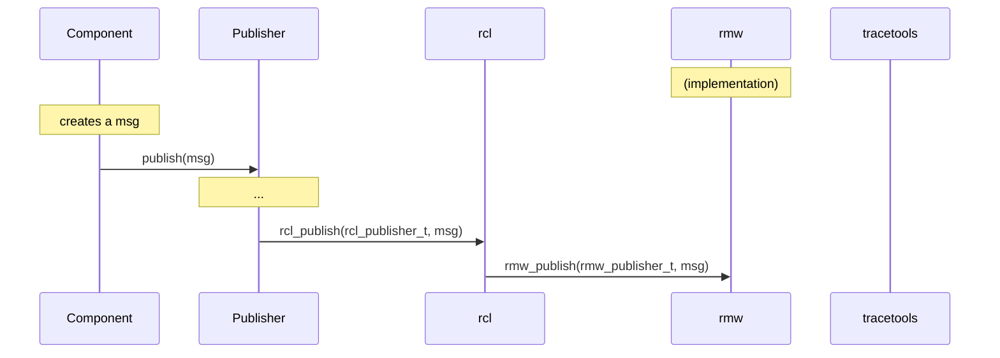

# ROS 2 design notes for instrumentation

The goal is to document ROS 2's design/architecture through descriptions of the main execution flows in order to properly design the instrumentation for it.

## Notes on client libraries

ROS 2 has changed the way it deals with client libraries. It offers a base ROS client library (`rcl`) written in C. This client library is the base for any language-specific implementation, such as `rclcpp` and `rclpy`.

However, `rcl` is obviously fairly basic, and still does leave a fair amount of implementation work up to the client libraries. For example, callbacks are not at all handled in `rcl`, and are left to the client library implementations.

This means that some instrumentation work might have to be re-done for every client library that we want to trace. We cannot simply instrument `rcl`, nor can we only instrument the base `rmw` interface if we want to dig into that.

This document will (for now) mainly discuss `rcl` and `rclcpp`, but `rclpy` should eventually be added and supported.

## Flow description

### Process creation

In the call to `rclcpp::init()`, a process-specific `rclcpp::Context` object is fetched and CLI arguments are parsed. Much of the work is actually done by `rcl` through a call to `rcl_init()`. This call processes the `rcl_context_t` handle, which is wrapped by the `Context` object. Also, inside this call, `rcl` calls `rmw_init()` to process the `rmw` context (`rmw_context_t`) as well. This `rmw` handle is itself part of the `rcl_context_t` handle.

This has to be done once per process, and usually at the very beginning. The components that are then instanciated share this context.

### Node/component creation

In ROS 2, a process can contain multiple nodes. These are sometimes referred to as "components."

These components are instanciated by the containing process. They are usually classes that extend `rclcpp::Node`, so that the node initialization work is done by the parent constructor.

This parent constructor will allocate its own `rcl_node_t` handle and call `rcl_node_init()`, which will validate the node name/namespace. `rcl` will also call `rmw_create_node()` to get the node's `rmw` handle (`rmw_node_t`). This will be used later by publishers and subscriptions.

### Publisher creation

The component calls `create_publisher()`, a `rclcpp::Node` method for convenience. That ends up creating an `rclcpp::Publisher` object which extends `rclcpp::PublisherBase`. The latter allocates an `rcl_publisher_t` handle, fetches the corresponding `rcl_node_t` handle, and calls `rcl_publisher_init()` in its constructor. `rcl` does topic name expansion/remapping/validation. It creates an `rmw_publisher_t` handle by calling `rmw_create_publisher()` of the given `rmw` implementation and associates with the node's `rmw_node_t` handle and the publisher's `rcl_publisher_t` handle.

If intra-process publishing/subscription is enabled, it will be set up after creating the publisher object, through a call to `PublisherBase::setup_intra_process()`, which calls `rcl_publisher_init()`.

### Subscription creation

Subscription creation is done in a very similar manner.

The componenent calls `create_publisher()`, which ends up creating an `rclcpp::Subscription` object which extends `rclcpp::SubscriptionBase`. The latter allocates an `rcl_subscription_t` handle, fetches its `rcl_node_t` handle, and calls `rcl_subscription_init()` in its constructor. `rcl` does topic name expansion/remapping/validation. It creates an `rmw_subscription_t` handle by calling `rmw_create_subscription()` of the given `rmw` implementation and associates it with the node's `rmw_node_t` handle and the subscription's `rcl_subscription_t` handle.

If intra-process publishing/subscription is enabled, it will be set up after creating the subscription object, through a call to `Subscription::setup_intra_process()`, which calls `rcl_subscription_init()`. This is very similar to a normal (inter-process) subscription, but it sets some flags for later.

### Executors

An `rclcpp::executor::Executor` object is created for a given process. It can be a `SingleThreadedExecutor` or a `MultiThreadedExecutor`.

Components are instanciated, usually as a `shared_ptr` through `std::make_shared<Component>()`, then added to the executor with `Executor::add_node()`.

After all the components have been added, `Executor::spin()` is called. `SingleThreadedExecutor::spin()` simply loops forever until the process' context isn't valid anymore. It fetches the next `rclcpp::AnyExecutable` (e.g. subscription, timer, service, client), and calls `Executor::execute_any_executable()` with it. This then calls the relevant `execute*()` method (e.g. `execute_timer()`, `execute_subscription()`, `execute_intra_process_subscription()`, `execute_service()`, `execute_client()`).

### Subscription callbacks

Subscriptions are handled in the `rclcpp` layer. Callbacks are wrapped by an `rclcpp::AnySubscriptionCallback` object, which is registered when creating the `rclcpp::Subscription` object.

In `execute_*subscription()`, the `Executor` asks the `Subscription` to allocate a message though `Subscription::create_message()`. It then calls `rcl_take*()`. If that is successful, it then passes that on to the subscription through `rclcpp::SubscriptionBase::handle_message()`. This checks if it's the right type of subscription (i.e. inter vs. intra process), then it calls `dispatch()` on the `rclcpp::AnySubscriptionCallback` object with the message (cast to the actual type). This calls the actual `std::function` with the right signature.

Finally, it returns the message object through `Subscription::return_message()`.

### Message publishing

To publish a message, an object is first allocated and then populated by the `Component` (or equivalent). Then, the message is sent to the `Publisher` through `publish()`. This then passes that on to `rcl`, which itself passes it to `rmw`.

TODO add inter- vs. intra-process execution flow
TODO talk about IntraProcessManager stuff?

### Service creation

### Timer creation

### Service callbacks

### Timer callbacks
